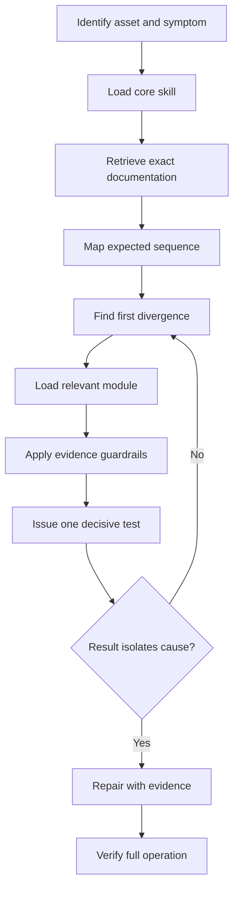

# Version 1 architecture

## Design goals

1. Accuracy before confident language.
2. Fast localization of the first failed sequence step.
3. One high-information next test rather than a parts list.
4. Exact-model documentation before proprietary claims.
5. Minimal context: core plus only the relevant domain module(s).
6. Safe, reproducible field instructions.

## Runtime flow

## Context routing

The core skill always owns the evidence ledger, response contract, source policy, confidence language, and completion gate. A module adds the domain-specific signal/energy chain and measurement pitfalls. Multiple modules load only when the first-failure chain crosses domains—for example PLC output to hydraulic proportional valve, or temperature-controller output to an electrical heater branch.

## Evidence ledger

The active diagnosis should track:

| Field | Meaning |
|---|---|
| Asset identity | Manufacturer, model, serial, controller, revision |
| Exact symptom | Function, mode, timing, repeatability |
| Expected step | Documented event at the current sequence point |
| Actual evidence | Observation, reading, diagnostic state, or source citation |
| Hypotheses | Small set of falsifiable explanations |
| Eliminated causes | Cause plus the result that eliminated it |
| Contradictions | Evidence that does not fit the leading explanation |
| Next test | One safe test with predicted branches |
| Confidence | confirmed, likely, possible, or unknown |

## Source boundary

V1 can reason over documents supplied in the conversation or attached to the plugin. It does not claim an alarm definition when the exact document is absent. The future retrieval service is described separately and is not required for V1.

## Non-goals for V1

- no automatic writes to a CMMS or machine
- no PLC downloads, remote control, parameter writes, or safety bypasses
- no persistent machine history
- no broad, uncurated manual dump
- no automatic part purchasing

These boundaries keep the first version inspectable and safe while the diagnostic behavior is tested.
