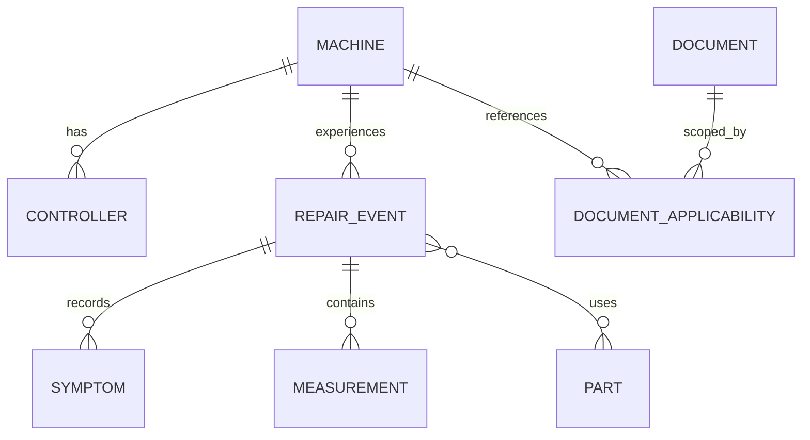

# Future MCP and repair-history design

This is a Version 2+ specification. Version 1 does not expose an MCP server and `.codex-plugin/plugin.json` intentionally has no `mcpServers` entry.

## Separation of concerns

- **Manual/document store:** immutable source files, revisions, metadata, and searchable chunks.
- **Maintenance history store:** asset-specific symptoms, measurements, conclusions, repairs, parts, and verification.
- **MCP service:** read-oriented diagnostic tools first; controlled writes only after explicit user confirmation.

Manual search results and historical repair results must remain distinguishable. A past repair is evidence about one asset, not an OEM instruction.

## Proposed read tools

| Tool | Purpose | Minimum input |
|---|---|---|
| `machine_lookup` | Resolve asset profile and installed controls | asset ID or model/serial |
| `document_search` | Search exact applicable manuals/prints | manufacturer, model, controller, query |
| `alarm_lookup` | Return alarm definition with source/revision | component identity, alarm code/text |
| `repair_history_search` | Find comparable verified failures | asset/model, symptom/alarm |
| `parameter_history` | Show authorized parameter changes | asset, parameter, time range |
| `measurement_history` | Return prior readings with test context | asset, point/type, time range |
| `part_lookup` | Find installed/approved part numbers | asset, assembly/component |
| `recurring_failure_search` | Group repeated faults/root causes | asset/group, time range |

Every result should include source type, asset applicability, timestamp/revision, confidence, and stable record ID. Document tools return page/section citations; history tools return repair-event IDs.

## Proposed controlled write tools

- `record_diagnostic_session`
- `append_measurement`
- `record_repair`
- `link_part_used`
- `close_repair_with_verification`

Writes require explicit confirmation, actor identity, timestamp, immutable audit data, and idempotency keys. The server must never infer that a hypothesis is a confirmed root cause.

## Relational model

Core entities:

- `machine`: asset ID, manufacturer, model, serial, year, location, criticality
- `controller`: machine ID, type, manufacturer, model, firmware, network/address notes
- `repair_event`: machine ID, opened/closed time, operating state, fault/alarm, confirmed root cause, repair, verifier
- `symptom`: repair-event ID, exact observation, first-failed sequence step
- `measurement`: repair-event ID, type, instrument, setting, reference point, test point, machine state, value/unit, timestamp
- `part`: manufacturer, part number, revision, description
- `repair_part`: repair-event ID, part ID, quantity, removed/installed serial
- `parameter_change`: machine/controller ID, name/address, old/new value, reason, approver, backup reference
- `document`: OEM, title, document number, revision, checksum, URI, source status
- `document_applicability`: document ID, machine/model/controller/firmware scope

## Retrieval and ranking

Filter for exact applicability before semantic similarity. Rank exact serial/as-built documents, exact model/controller/revision documents, verified same-asset history, exact component manuals, then broader analogues. Return “no exact source found” instead of silently broadening.

## Recommended implementation path

1. Local fixtures and read-only MCP prototype.
2. Supabase/Postgres tables with row-level security and object storage for authorized documents.
3. Document ingestion with checksum, revision, applicability, OCR status, and page citations.
4. Read tools plus automated contract tests.
5. Explicitly confirmed write tools and audit trail.
6. Only then connect the plugin manifest to the deployed remote MCP endpoint.
